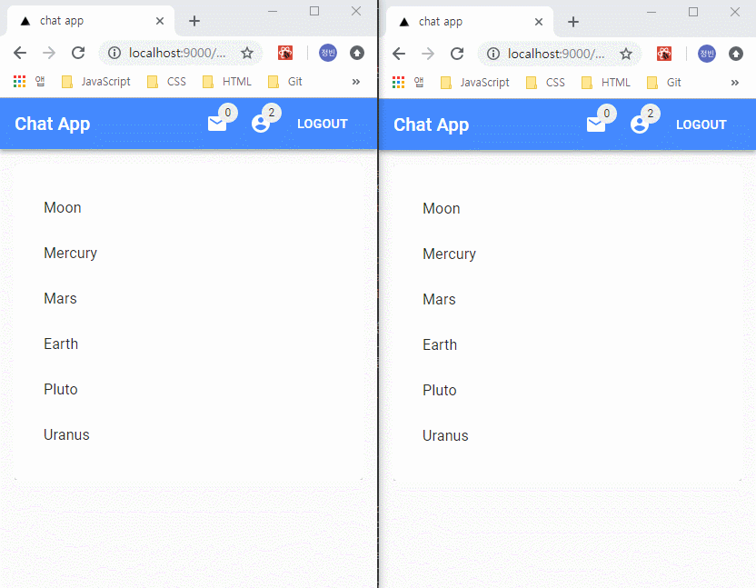
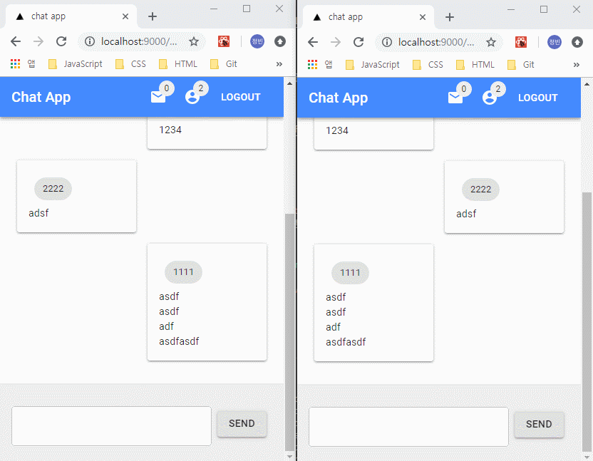

# 채널 입장 및 퇴장 구현

## 화면 예제

### 채팅방 입장 및 퇴장



### 메시지 전송


### 이미지 전송



## 컴포넌트

### 채팅방 목록 페이지

- `componets/page/list.jsx`
  - `render()` - 채팅방 목록 컴포넌트 호출

```jsx
class List extends Component {
  state = {
    rooms: ['Moon', 'Mercury', 'Mars', 'Earth', 'Pluto', 'Uranus']
  };

  render() {
    const { classes } = this.props;
    const { rooms } = this.state;

    return (
      <Grid container>
        <Grid item xs={12}>
          <Paper className={classes.paper} elevation={1}>
            <Rooms rooms={rooms} />
          </Paper>
        </Grid>
      </Grid>
    );
  }
}
```

### 채팅방 목록 화면

- `componets/organisms/Rooms.jsx`
  - `render()` - 채팅방 클릭 시 해당 채팅방으로 이동

```jsx
class Rooms extends Component {
  render() {
    const { rooms } = this.props;
    return (
      <List component="nav">
        {rooms.map((room, i) => (
          <ListItem button key={i}>
            <Link route={`/chat/${room.toLowerCase()}`}>
              <ListItemText primary={room} />
            </Link>
          </ListItem>
        ))}
      </List>
    );
  }
}
```

### 채팅방 페이지

- `componets/pages/chat.jsx`
  - `mounted` - 컴포넌트 언마운트 이후 상태 변경을 차단하기 위한 변수
  - `componentDidMount()`
    - 소켓 접속 및 컴포넌트 마운트 확인 변수 설정
    - `socket.emit('join')` - 채팅방 입장 정보 서버 수신
    - `socket.on('join')` - 입장 정보 수신 후 메시지 출력
    - `socket.on('leave')` - 퇴장 정보 수신 후 메시지 출력
    - `socket.on('resetMessages')` - 메시지 삭제 정보 수신 후 메시지 정보 삭제
    - `socket.on('chat')` - 메시지 정보 수신 후 메시지 출력
    - `socket.on('updateUser')` - 현재 사용자 정보 수신 후 사용자 정보 업데이트
  - `componentWillUnmount()`
    - `socket.emit('leave')` - 언마운트 시 퇴장정보 서버 수신
  - `receiveMessage()` - 전달받은 메시지 정보 state 저장
  - `sendMessage()` - 사용자가 입력한 메시지 또는 이미지 정보 서버 수신
  - `resetMessages()` - 메시지 정보 state 제거
  - `render()` - 메시지 목록, 입력 영역 컴포넌트 호출

```jsx
class Chat extends Component {
  state = {
    messages: []
  };

  mounted = false;

  componentDidMount() {
    const { chat, router } = this.props;
    chat.connect();
    const { socket, user } = chat;

    this.mounted = true;

    socket.emit('join', {
      user,
      room: router.query.room
    });

    socket.on('join', data => {
      if (this.mounted) {
        this.receiveMessage(data);
      }
    });

    socket.on('leave', data => {
      if (this.mounted) {
        this.receiveMessage(data);
      }
    });

    socket.on('resetMessages', () => {
      if (this.mounted) {
        this.resetMessages();
      }
    });

    socket.on('chat', data => {
      if (this.mounted) {
        this.receiveMessage(data);
      }
    });

    socket.on('updateUser', ({ user }) => {
      if (this.mounted) {
        chat.setUser(user);
      }
    });
  }

  componentWillUnmount() {
    const { router, chat } = this.props;
    const { socket, user } = chat;

    this.mounted = false;

    socket.emit('leave', {
      user,
      room: router.query.room
    });
  }

  receiveMessage = ({ messages }) => {
    const newMessages = this.state.messages.concat();
    newMessages.push(messages);
    this.setState({
      messages: newMessages
    });
    scroll.scrollToBottom();
  };

  sendMessage = ({ type, message = '', images = [] }) => {
    const { router, chat } = this.props;
    const { socket, user } = chat;
    socket.emit('chat', {
      user,
      room: router.query.room,
      type,
      message,
      images
    });
  };

  resetMessages = () => {
    this.setState({
      messages: []
    });
  };

  render() {
    const { router, chat } = this.props;
    const myself = chat.user;
    const { messages } = this.state;

    return (
      <Fragment>
        <Typography variant="h3" gutterBottom>
          {router.query.room}
        </Typography>
        <Messages messages={messages} myself={myself} />
        <InputArea sendMessage={this.sendMessage} />
      </Fragment>
    );
  }
}
```

### 메시지 목록

- `componets/organisms/Messages.jsx`
  - `render()` - 메시지 컴포넌트 출력 및 각 메시지별 자신의 사용자 정보 props 전달
-

```jsx
class Messages extends Component {
  render() {
    const { messages, myself } = this.props;

    return (
      <Grid container>
        {messages.map((message, i) => (
          <Message key={i} {...message} myself={myself} />
        ))}
      </Grid>
    );
  }
}
```

### 메시지

- `componets/molecules/Message.jsx`
  - `render()`
    - 메시지 정보에 따라 메시지 크기 및 표시 위치 설정
    - 위치에 따른 빈 공간 컴포넌트 설정
    - 이미지 정보가 있을 경우 이미지 컴포넌트 표시
    - `react-motion` 라이브러리를 활용한 메시지 출력 시 애니메이션 구현

```jsx
class Message extends Component {
  state = {
    info: {
      xs: 12
    },
    text: {
      xs: 6
    },
    image: {
      xs: 6
    }
  };

  render() {
    const { classes, type, message, user, myself, images } = this.props;
    const isInfo = type === 'info';
    const isMyMsg = user.socketId === myself.socketId;

    return (
      <Fragment>
        <GridSpace hasSpace={!isInfo && isMyMsg} xs={6} />
        <Grid item xs={this.state[type].xs}>
          <ResizeDetector handleWidth>
            {(width = 0) => (
              <Motion
                style={{
                  transformX: spring(isMyMsg ? width : -width),
                  opacity: spring(width ? 1 : 0)
                }}
              >
                {({ transformX, opacity }) => (
                  <Paper
                    className={classes.paper}
                    style={{
                      transform: `translatex(${(isMyMsg ? width : -width) -
                        transformX}px)`,
                      opacity
                    }}
                  >
                    {!isInfo && (
                      <Chip label={user.userId} className={classes.chip} />
                    )}
                    {message.split('\n').map((line, i) => (
                      <Typography key={i}>{line}</Typography>
                    ))}
                    {images.map((image, i) => (
                      <Image key={i} {...image} />
                    ))}
                  </Paper>
                )}
              </Motion>
            )}
          </ResizeDetector>
        </Grid>
        <GridSpace hasSpace={!isInfo && !isMyMsg} xs={6} />
      </Fragment>
    );
  }
}
```

### 빈 공간 출력

- `componets/atoms/GridSpace.jsx`
  - `render()` - 빈공간이 필요할 경우 자식요소가 없는 컴포넌트 반환

```jsx
class GridSpace extends Component {
  render() {
    const { hasSpace, xs } = this.props;

    if (hasSpace) {
      return <Grid item xs={xs} />;
    }

    return null;
  }
}
```

### 이미지

- `componets/atoms/Image.jsx`
  - `render()` - base64 데이터를 이용한 이미지 컴포넌트 반환

```jsx
class Image extends Component {
  render() {
    const { base64, name } = this.props;

    return (
      
    );
  }
}
```

### 메시지 / 이미지 파일 드롭

- `componets/organisms/InputArea.jsx`
  - `render()`
    - 화면에 파일 드래그 여부에 따라 이미지 드롭 영역 또는 메시지 입력 컴포넌트 반환

```jsx
class InputArea extends Component {
  render() {
    const { classes } = this.props;

    return (
      <Fragment>
        <div className={classes.space} />
        <NativeFiles>
          {props => {
            const { canDrop, files } = props;

            if (canDrop || files.length) {
              return (
                <div color="secondary" className={classes.root}>
                  <ImageField {...this.props} {...props} />
                </div>
              );
            }

            return (
              <Fade in={!canDrop}>
                <div color="secondary" className={classes.root}>
                  <MessageField {...this.props} />
                </div>
              </Fade>
            );
          }}
        </NativeFiles>
      </Fragment>
    );
  }
}
```

### 이미지 파일 드롭

- `componets/molecules/ImageField.jsx`
  - `sendImages` - 화면의 드롭된 이미지 목록에 대한 base64 데이터 확인 후 메시지 전송 후 드롭된 이미지 삭제
  - `render()`
    - 화면에 파일 목록이 드래그 중인 경우 안내 메시지 출력
    - 드롭된 파일 목록 확인 후 이미지 파일이 아닌 경우 경고 메시지 출력 및 전송 버튼 비활성화
    - 이미지 목록 전송 버튼 및 파일 목록 삭제 버튼 출력

```jsx
class ImageField extends Component {
  sendImages = async image => {
    const { files, sendMessage, removeFiles } = this.props;
    const images = await Promise.all(
      files.map(async file => await getImageInfo(file))
    );

    sendMessage({ type: 'image', images });
    removeFiles();
  };

  render() {
    const { canDrop, isOver, files, classes, removeFiles } = this.props;
    const isActive = canDrop && isOver;
    let hasNotImage = false;

    if (!files.length) {
      return (
        <Paper
          elevation={1}
          className={`${classes.paper} ${isActive ? classes.active : ''}`}
        >
          <Typography
            variant="h5"
            className={`${isActive ? classes.active : ''}`}
          >
            이미지를 올려주세요.
          </Typography>
        </Paper>
      );
    }

    return (
      <Paper
        elevation={1}
        className={`${classes.paper} ${isActive ? classes.active : ''}`}
      >
        {files.map((file, i) => {
          if (!file.type.includes('image')) {
            hasNotImage = true;
            return (
              <Typography
                key={i}
                variant="h5"
                className={`${isActive ? classes.active : ''}`}
              >
                이미지 파일만 올려주세요.
              </Typography>
            );
          }

          return (
            <div
              variant="h5"
              key={i}
              className={`${isActive ? classes.active : ''}`}
            >
              <AsyncImage image={file}>
                {image => <Image {...image} />}
              </AsyncImage>
            </div>
          );
        })}
        <div>
          <Button
            variant="contained"
            color="primary"
            className={classes.button}
            onClick={this.sendImages}
            disabled={hasNotImage}
          >
            SEND
          </Button>
          <Button
            variant="contained"
            color="secondary"
            className={classes.button}
            onClick={removeFiles}
          >
            DELETE
          </Button>
        </div>
      </Paper>
    );
  }
}
```

### 이미지 비동기 처리

- `componets/atoms/AsyncImage.jsx`
  - `setImage()` - 이미지 목록에 대한 base64 데이터 확인 후 state 설정
  - `shouldComponentUpdate()` - 컴포넌트 업데이트 전 props, state 상태 비교를 통해 불필요한 업데이트 중지
  - `componentDidUpdate()` - 컴포넌트 업데이트 후 이미지 정보 확인 함수 호출
  - `render()`
    - 이미지 base64 정보가 없을 경우 빈 컴포넌트 반환.
    - 비동기 함수의 반환 데이터 확인 후 child as function 내 인자로 base64 정보 전달

```jsx
class AsyncImage extends Component {
  state = {
    image: {}
  };

  setImage = async () => {
    const image = await getImageInfo(this.props.image);

    this.setState({
      image
    });
  };

  shouldComponentUpdate(nextProps, nextState) {
    if (nextState.image.name === this.state.image.name) {
      if (!nextState.image.name && !this.state.image.name) {
        return true;
      }

      if (nextProps.image.name !== this.props.image.name) {
        return true;
      }
      return false;
    }

    return true;
  }

  componentDidUpdate() {
    this.setImage();
  }

  render() {
    const { image } = this.state;
    const { children } = this.props;

    if (!image.base64) {
      return null;
    }

    return children(image);
  }
}
```

### 메시지 입력

- `componets/molecules/MessageField.jsx`
  - `handleChange()` - 입력 메시지에 대한 state 설정
  - `sendMessage()` - 입력 값이 있는 경우 입력 메시지 서버 수신 후 메시지 초기화
  - `render()` - 입력 필드 및 메시지 수신 버튼 컴포넌트 구성

```jsx
class MessageField extends Component {
  state = {
    message: ''
  };

  handleChange = e => {
    this.setState({
      message: e.target.value
    });
  };

  sendMessage = () => {
    const { message } = this.state;

    if (!message.trim()) {
      return;
    }

    this.props.sendMessage({ type: 'text', message });
    this.setState({
      message: ''
    });
  };

  render() {
    const { classes } = this.props;
    const { message } = this.state;

    return (
      <Fragment>
        <div className={classes.inputContainer}>
          <TextField
            fullWidth
            margin="normal"
            variant="outlined"
            multiline={true}
            className={classes.input}
            value={message}
            onChange={this.handleChange}
          />
        </div>
        <div className={classes.buttonContainer}>
          <Button
            variant="contained"
            className={classes.button}
            onClick={this.sendMessage}
          >
            SEND
          </Button>
        </div>
      </Fragment>
    );
  }
}
```

## 소켓 구현

- `socket.on('join')` - 채널 입장 송신

  - 채널 입장 시 업데이트되는 사용자 정보 갱신 후 이 전 현재 사용자 정보 삭제
  - `socket.emit('updateUser')` - 현재 사용자에게 갱신된 사용자 정보 수신
  - `io.emit('updateUsers')` - 전체 사용자에서 업데이트된 전체 사용자 정보 수신
  - `io.to(room).emit('join')` - 채팅방 사용자에게 현재 사용자 입장 메시지 수신

- `socket.on('chat')` - 메시지 정보 송신

  - `io.to(room).emit('chat')` - 채팅방 사용자에게 현재 사용자가 입력한 메시지 수신

- `socket.on('leave')` - 채널 입장 송신
  - 전체 사용자 목록 중 현재 사용자의 채팅방 정보 갱신
  - `io.emit('updateUsers')` - 전체 사용자에서 업데이트된 전체 사용자 정보 수신
  - `io.to(room).emit('leave')` - 채팅방 사용자에게 현재 사용자 퇴장 메시지 수신

```javascript
socket.on('join', ({ room, user }) => {
  socket.join(room);
  users = users.filter(currentUser => currentUser.socketId !== user.socketId);

  if (user.userId) {
    users.push({
      userId: user.userId,
      socketId: socket.id,
      room
    });
  }

  socket.emit('updateUser', {
    user: {
      ...user,
      socketId: socket.id
    }
  });

  io.emit('updateUsers', {
    users
  });

  io.to(room).emit('join', {
    messages: {
      user: {
        ...user,
        socketId: socket.id
      },
      type: 'info',
      message: `${user.userId}님이 입장했습니다.`,
      images: []
    }
  });
});

socket.on('chat', ({ room, user, type, message, images }) => {
  io.to(room).emit('chat', {
    messages: {
      user,
      type,
      message,
      images
    }
  });
});

socket.on('leave', ({ room, user }) => {
  users = users.map(user => {
    if (user.socketId === socket.id) {
      user.room = '';
    }
    return user;
  });

  io.emit('updateUsers', {
    users
  });

  io.to(room).emit('leave', {
    messages: {
      user,
      type: 'info',
      message: `${user.userId}님이 퇴장했습니다.`,
      images: []
    }
  });

  socket.emit('resetMessages');
  socket.leave(room);
});
```
