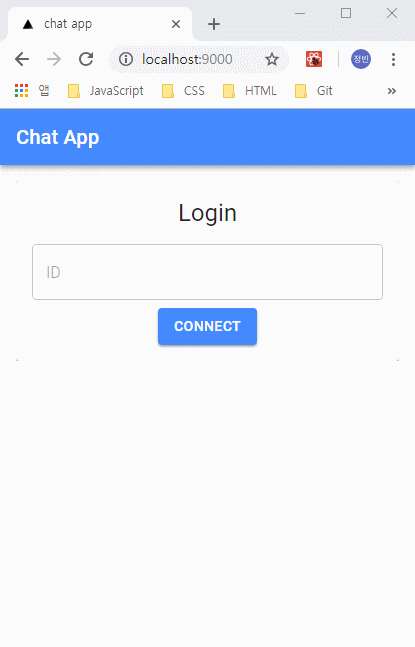

# 로그인 구현

## 화면 예제

### 로그인



## 컴포넌트

## 접속 페이지

- `componets/page/index.jsx`
  - `render()` - 접속 화면 컴포넌트 호출

```jsx
class Index extends Component {
  render() {
    const { classes } = this.props;

    return (
      <Grid container>
        <Grid item xs={12}>
          <Paper className={classes.paper} elevation={1}>
            <Connect {...this.props} />
          </Paper>
        </Grid>
      </Grid>
    );
  }
}
```

### 접속 화면

- `componets/organisms/Connect.jsx`
  - `componentDidMount()` - 사용자정보와 전체 사용자 정보를 설정하는 클라이언트 소켓 송신 함수를 설정
  - `onConnect()` - 유효성 검증 확인 후 서버 소켓 수신 함수 호출
  - `render()` - `formik` 라이브러리를 활용해 유효성 검증을 확인
    - 검증 항목 - 필수값, 최소길이, 최대길이, 소켓 연결 여부

```jsx
class Connect extends Component {
  state = {
    form: {
      userId: ''
    }
  };

  componentDidMount() {
    const { chat } = this.props;
    chat.connect();
    const { socket } = chat;

    socket.on('login', ({ user }) => {
      chat.setUser(user);
      Router.pushRoute('/list');
    });

    socket.on('updateUsers', ({ users }) => {
      chat.setUsers(users);
    });
  }

  onConnect = (values, { setErrors, setSubmitting }) => {
    const { socket } = this.props.chat;

    if (!socket || socket.io.readyState === 'closed') {
      setErrors({ userId: '새로고침 후 다시 접속해주세요.' });
      setSubmitting(false);
      return;
    }

    socket.emit('login', {
      user: {
        userId: values.userId
      }
    });
  };

  render() {
    return (
      <Formik
        initialValues={this.state.form}
        validationSchema={Yup.object().shape({
          userId: Yup.string()
            .min(3, '3글자 이상 입력해주세요')
            .max(10, '10글자 이하로 입력해주세요')
            .required('ID를 입력해주세요')
        })}
        onSubmit={this.onConnect}
        render={({ submitForm, isSubmitting }) => (
          <ConnectForm submitForm={submitForm} isSubmitting={isSubmitting} />
        )}
      />
    );
  }
}

export default Connect;
```

### 접속 폼

- `componets/molecules/ConnectForm.jsx`
  - `render()`
    - `formik-material-ui` 라이브러리를 활용해 `TextField` 컴포넌트 및 필드 정보를 `Field` 컴포넌트에 주입
    - ID 입력 및 접속 버튼 클릭시 상위 컴포넌트(`componets/organisms/Connect.jsx`)에서 전달받은 함수 호출

```jsx
import { fieldToTextField } from 'formik-material-ui';

const WrappedTextField = props => (
  <TextField
    {...fieldToTextField(props)}
    onChange={event => {
      const { value } = event.target;
      props.form.setFieldValue(props.field.name, value ? value : '');
    }}
  />
);

class ConnectForm extends Component {
  render() {
    const { classes, isSubmitting, submitForm } = this.props;
    return (
      <Form className={classes.container}>
        <Typography variant="h5">Login</Typography>
        <Field
          name="userId"
          type="text"
          component={WrappedTextField}
          fullWidth
          margin="normal"
          variant="outlined"
          placeholder="ID"
        />
        <Button
          variant="contained"
          color="primary"
          disabled={isSubmitting}
          onClick={submitForm}
        >
          Connect
        </Button>
        <ProgressLoader isLoading={isSubmitting} className={classes.loader} />
      </Form>
    );
  }
}
```

### 로딩 바

- `componets/atoms/ProgressLoader.jsx`
  - `render()` - 접속 시 폼 유효성 확인을 하는 동안 로딩바 표시

```jsx
class ProgressLoader extends Component {
  render() {
    const { isLoading, className } = this.props;

    if (isLoading) {
      return (
        <div className={className}>
          <CircularProgress />
        </div>
      );
    }

    return null;
  }
}

export default ProgressLoader;
```

## 소켓 설정

- `socket.on('login')` - 로그인 정보 송신
  - 아이디 여부 확인 및 전체 사용자 목록에 현재 사용자 추가
  - `socket.emit('login')` - 현재 사용자에게 사용자 아이디 및 소켓 아이디 정보 수신
  - `io.emit('updateUsers')` - 전체 사용자에서 업데이트된 전체 사용자 정보 수신

```javascript
let users = [];

socket.on('login', ({ user }) => {
  if (user.userId) {
    users.push({
      userId: user.userId,
      socketId: socket.id
    });
  }

  socket.emit('login', {
    user: {
      ...user,
      socketId: socket.id
    }
  });

  io.emit('updateUsers', {
    users
  });
});
```
