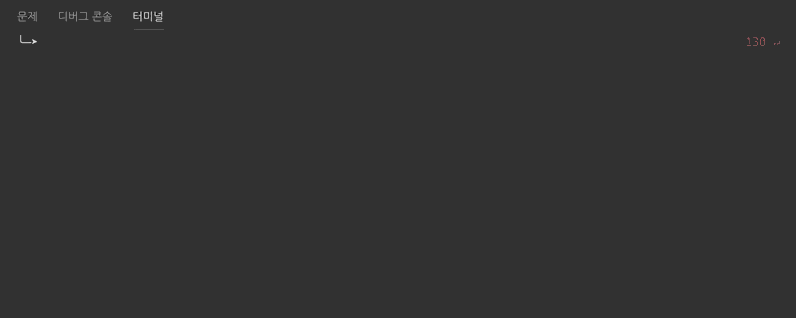

# 단위 테스트 구현

## mocha 옵션 설정

```bash
--require @babel/register
--file test/mocha.setup.js
--watch
test/**/*.test.js
```

## 실행 전 호출 파일 설정

- `enzyme`을 활용한 컴포넌트 어뎁터 설정
- `jsdom`을 활용한 테스트 DOM 설정

```javascript
import Enzyme from 'enzyme';
import Adapter from 'enzyme-adapter-react-16';
import 'jsdom-global/register';

Enzyme.configure({ adapter: new Adapter() });
```

## 주요 테스트 검증 목록

### 파일 관련 컴포넌트

- `File` 객체를 활용한 컴포넌트 테스트

```javascript
describe('<AsyncImage />', () => {
  const props = {
    image: { name: 'test.js', type: 'image', base64: 'base64' }
  };

  let file = {};

  const wrapper = mount(
    <AsyncImage {...props}>
      {props => }
    </AsyncImage>
  );

  it('기본 props 전달 확인', () => {
    expect(wrapper.props().image).to.deep.equal(props.image);
  });

  it('이미지 파일 props 전달 확인', () => {
    file = new File(['test'], './test.jpg', {
      type: 'image/jpg'
    });
    wrapper.setProps({ image: file });
    expect(wrapper.props().image).to.deep.equal(file);
  });

  it('setImage() 실행 시 이미지 파일명 확인', () => {
    wrapper.instance().setImage();
    expect(wrapper.state().image.name).to.equal('.:test.jpg');
  });

  it('shouldComponentUpdate 호출 시 반환값 확인', () => {
    expect(
      wrapper.instance().shouldComponentUpdate(wrapper.props(), wrapper.state())
    ).to.be.false;

    expect(
      wrapper
        .instance()
        .shouldComponentUpdate(wrapper.props(), { image: { name: 'test3' } })
    ).to.be.true;

    expect(
      wrapper.instance().shouldComponentUpdate(wrapper.props(), {
        image: { name: undefined }
      })
    ).to.be.true;
  });

  it('componentDidUpdate 호출 후 이미지 파일명 확인', done => {
    file = new File(['test1'], './test1.jpg', {
      type: 'image/jpg'
    });
    wrapper.setProps({ image: file });
    wrapper.instance().componentDidUpdate();
    setTimeout(() => {
      expect(wrapper.state().image.name).to.equal('.:test1.jpg');
      done();
    }, 100);
  });

  it('function as child props 확인', () => {
    const childWrapper = mount(wrapper.props().children(wrapper.state().image));
    expect(childWrapper.props().alt).to.equal('.:test1.jpg');
  });
});
```

### 이벤트 제어 관련 컴포넌트

- `enzyme`에서 제공하는 `simulate()`함수를 활용한 컴포넌트 테스트

```javascript
describe('<ConnectForm />', () => {
  const initialValues = {
    userId: ''
  };

  const onSubmit = (values, { setSubmitting }) => {
    setTimeout(() => {
      setSubmitting(false);
    }, 100);
  };

  const wrapper = mount(
    <Formik
      initialValues={initialValues}
      validationSchema={Yup.object().shape({
        userId: Yup.string()
          .min(3, '3글자 이상 입력해주세요')
          .required('ID를 입력해주세요')
      })}
      onSubmit={onSubmit}
      render={({ submitForm, isSubmitting }) => (
        <ConnectForm submitForm={submitForm} isSubmitting={isSubmitting} />
      )}
    />
  );

  const input = wrapper.find('input');
  const button = wrapper.find('button');

  it('기본 props 전달 확인', () => {
    expect(wrapper.props().onSubmit).to.equal(onSubmit);
    expect(wrapper.props().initialValues).to.deep.equal(initialValues);
  });

  it('id input 창 입력 확인', () => {
    input.simulate('change', { target: { value: 'Hello' } });
    expect(input.instance().value).to.equal('Hello');
  });

  it('id 팔수 입력 유효성 검사 확인', done => {
    input.simulate('change', { target: { value: '' } });
    expect(input.instance().value).to.equal('');
    setTimeout(() => {
      expect(wrapper.state().errors).to.deep.equal({
        userId: 'ID를 입력해주세요'
      });
      done();
    }, 100);
  });

  it('id 글자 길이 유효성 검사 확인', done => {
    input.simulate('change', { target: { value: '1' } });
    expect(input.instance().value).to.equal('1');
    setTimeout(() => {
      expect(wrapper.state().errors).to.deep.equal({
        userId: '3글자 이상 입력해주세요'
      });
      done();
    }, 100);
  });

  it('유효성 검사 실패시 접속 버튼 활성화 여부 확인', () => {
    expect(button.prop('disabled')).to.be.false;
  });

  it('유효성 검사 성공 시 submit 이벤트 확인', done => {
    input.simulate('change', { target: { value: 'success' } });
    button.simulate('click');
    expect(wrapper.state().isSubmitting).to.be.true;
    setTimeout(() => {
      expect(wrapper.state().isSubmitting).to.be.false;
      done();
    }, 200);
  });
});
```

### 소켓 연동 관련 컴포넌트

- socket 연동에 필요한 test 서버를 통해 소켓 송/수신 컴포넌트 테스트

```javascript
describe('<Chat />', () => {
  const store = initStore({});
  const router = { query: { room: 'moon' } };
  const props = {
    classes: {}
  };
  const user = {
    userId: 'user',
    socketId: 'user'
  };

  store.chat.setUser(user);

  const wrapper = mount(
    shallow(shallow(<Chat router={router} {...store} {...props} />).get(0)).get(
      0
    )
  );

  const wrappedComponent = wrapper.childAt(2).childAt(0);

  const { chat } = wrapper.props();
  wrapper.setState({ messages: [] });

  chat.connect('http://localhost:9002');

  it('props 확인', () => {
    expect(wrapper.props().router).to.equal(router);
    expect(chat).to.equal(store.chat);
  });

  it('사용자 채널 입장 시 동작 확인 및 receiveMessage() 호출 시 상태 확인', done => {
    chat.socket.on('join', data => {
      wrappedComponent.instance().receiveMessage(data);
      expect(wrappedComponent.state().messages.length).to.equal(1);
      done();
    });

    chat.socket.emit('join', {
      user,
      room: 'moon'
    });
  });

  it('sendMessage() 호출 시 chat socket 동작 확인', done => {
    wrappedComponent
      .instance()
      .sendMessage({ type: 'text', message: 'test입니다', images: [] });
    chat.socket.on('chat', data => {
      const { messages } = data;
      const { user, type, message } = messages;
      wrappedComponent.instance().receiveMessage(data);
      expect(user.userId).to.equal('user');
      expect(type).to.equal('text');
      expect(message).to.equal('test입니다');
      expect(wrappedComponent.state().messages.length).to.equal(2);
      done();
    });
  });

  it('leave socket 동작 확인 및 receiveMessage() 호출 시 동작 상태 확인', done => {
    chat.socket.emit('leave', {
      user,
      room: 'moon'
    });
    chat.socket.on('leave', data => {
      const { messages } = data;
      const { user, type, message } = messages;
      expect(user.userId).to.equal('user');
      expect(type).to.equal('info');
      expect(message).to.equal('user님이 퇴장했습니다.');
      wrappedComponent.instance().receiveMessage(data);
      expect(wrappedComponent.state().messages.length).to.equal(3);
      done();
    });
  });
});
```

## 실행결과

- 총 76개의 단위 테스트 확인



## 브라우저 테스트 (PC)

- 각 브라우저 별 최신 버전에서 테스트 확인

|  |  |  |  |  |
| --------------------------------- | ----------------------------------- | ---------------------------------------- | ------------------------------- | --------------------------------- |
| Latest ✔                          | Latest ✔                            | Latest ✔                                 | Latest ✔                        | Latest ✔                          |
