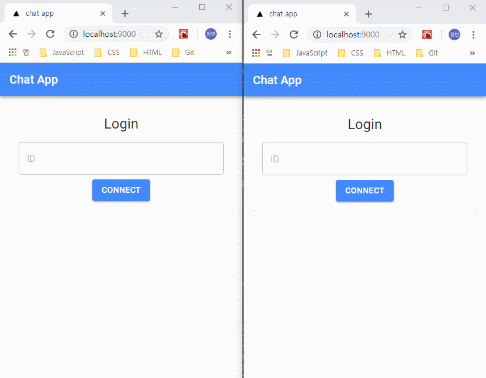
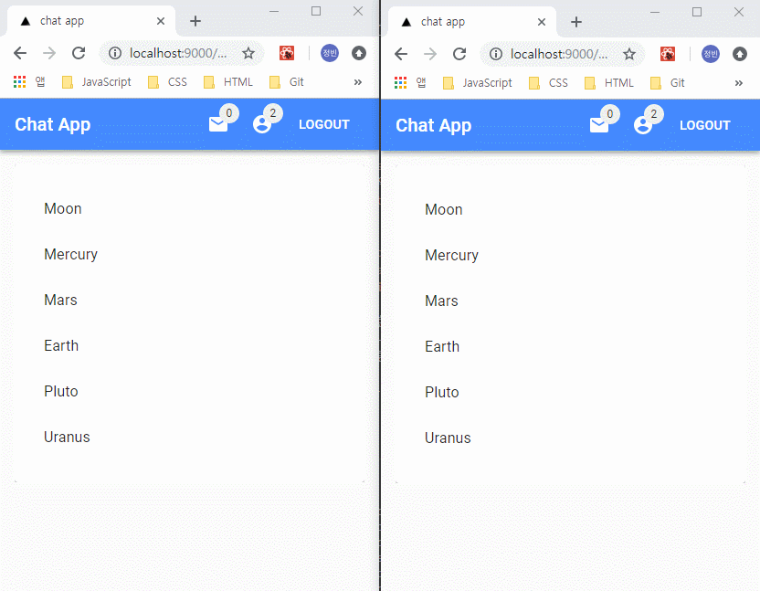
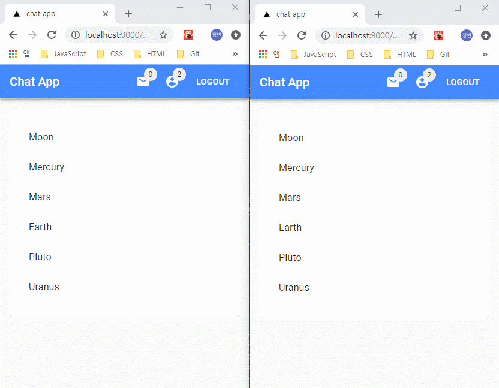

# HOC 및 공통 컴포넌트 구현

## 화면 예제

### 전체 사용자 목록 업데이트



### 사용자 초대



### 로그아웃



## 컴포넌트

### 메인 레이아웃

- `componets/templates/main.js`
  - `mobx`를 활용한 전역 상태 정보 주입
  - `componentDidMount()`
    - 사용자 정보 확인 후 페이지 변경
    - 소켓 수신 여부에 따른 관련 정보 설정
    - `socket.on('logout')` - 현재 사용자 정보 삭제 후 로그인 페이지 이동
    - `socket.on('updateUsers')` - 전체 사용자 정보 업데이트
    - `socket.on('inviteRoom')` - 현재 사용자에게 온 초대 정보 업데이트
  - `logout()` - 현재 사용자에 대한 로그아웃 정보를 `socket.emit('logout')`을 통해 서버 수신
  - `inviteRoom()` - 현재 사용자 및 초대할 사용자 정보, 채팅방 정보를 `socket.emit('inviteRoom')`을 통해 서버 수신
  - `removeInvite()` - 현재 사용자에게 온 초대 정보 제거
  - `moveRoom()` - 채팅방 이동. 입장시 `socket.emit('join')`, 퇴장 시 `socket.emit('leave')` 호출
  - `render()`
    - `next/head`를 통한 타이틀 설정
    - 상단 바 컴포넌트 설정

```jsx
const withMain = Page => {
  @inject('chat')
  @observer
  class MainWrapper extends React.Component {
    static async getInitialProps(ctx) {
      return {
        ...(Page.getInitialProps ? await Page.getInitialProps(ctx) : null)
      };
    }

    componentDidMount() {
      const { chat } = this.props;
      const { user, socket } = chat;

      if (!user.userId || !user.socketId) {
        Router.pushRoute('/');
      }

      if (socket) {
        socket.on('logout', () => {
          chat.setUser({ userId: '', socketId: '' });
          document.location.replace('/');
        });

        socket.on('updateUsers', ({ users }) => {
          chat.setUsers(users);
        });

        socket.on('inviteRoom', data => {
          chat.setInvites(data);
        });
      }
    }

    logout = () => {
      const { socket } = this.props.chat;
      socket.emit('logout');
    };

    inviteRoom = ({ sender, receiver, room }) => {
      const { socket } = this.props.chat;
      socket.emit('inviteRoom', {
        sender,
        receiver,
        room
      });
    };

    removeInvite = invite => {
      const { chat } = this.props;
      chat.removeInvites(invite);
    };

    moveRoom = ({ type, room }) => {
      const { user, socket } = this.props.chat;

      socket.emit(type, {
        user,
        room
      });
    };

    render() {
      const { classes, router, chat } = this.props;
      const { user, users, invites } = chat;

      return (
        <Fragment>
          <Head>
            <title>chat app</title>
          </Head>
          <AppBar
            user={user}
            users={users}
            invites={invites}
            classes={classes}
            room={router.query.room}
            logout={this.logout}
            inviteRoom={this.inviteRoom}
            removeInvite={this.removeInvite}
            moveRoom={this.moveRoom}
          />
          <div className={classes.root}>
            <Page {...this.props} classes={classes} />
          </div>
        </Fragment>
      );
    }
  }

  return withStyles(styles, { name: 'MainWrapper' })(MainWrapper);
};
```

### 상단 바

- `componets/organisms/AppBar.js`
  - `handleClick()` - 초대 및 사용자 목록 확인 버튼 클릭 여부에 따른 state 설정
  - `handleClose()` - 초대 및 사용자 목록을 벗어난 영역 클릭 시 state 설정
  - `moveList()` - 타이틀 영역 클릭 시 사용자 정보에 따른 페이지 이동 정보 변경
  - `render()` - 타이틀 링크, 초대 및 사용자 목록 확인 버튼, 로그아웃 버튼 컴포넌트로 구성

```jsx
class CustomAppBar extends Component {
  state = {
    userListEl: null,
    inviteListEl: null
  };

  handleClick = ({ e, type }) => {
    this.setState({
      [type]: e.currentTarget
    });
  };

  handleClose = ({ type }) => {
    this.setState({
      [type]: null
    });
  };

  moveList = () => {
    const { user } = this.props;

    if (!user.userId || !user.socketId) {
      document.location.replace('/');
    }

    Router.pushRoute('/list');
  };

  render() {
    const {
      user,
      users,
      room,
      classes,
      invites,
      inviteRoom,
      removeInvite,
      moveRoom
    } = this.props;
    const { userListEl, inviteListEl } = this.state;

    return (
      <Fragment>
        <AppBar position="fixed">
          <Toolbar>
            <Typography
              variant="h6"
              color="inherit"
              style={{
                cursor: 'pointer'
              }}
              onClick={this.moveList}
            >
              Chat App
            </Typography>
            <div style={{ flexGrow: 1 }} />
            <IconButton
              user={user}
              color="inherit"
              onClick={e => {
                this.handleClick({ e, type: 'inviteListEl' });
              }}
            >
              <Badge badgeContent={invites.length} color="secondary">
                <MailIcon />
              </Badge>
            </IconButton>
            <Popover
              id="simple-popper"
              open={Boolean(inviteListEl && invites.length)}
              anchorEl={inviteListEl}
              onClose={() => {
                this.handleClose({ type: 'inviteListEl' });
              }}
              anchorOrigin={{
                vertical: 'bottom',
                horizontal: 'center'
              }}
              transformOrigin={{
                vertical: 'top',
                horizontal: 'center'
              }}
            >
              <InviteList
                invites={invites}
                removeInvite={removeInvite}
                room={room}
                moveRoom={moveRoom}
              />
            </Popover>
            <IconButton
              user={user}
              color="inherit"
              onClick={e => {
                this.handleClick({ e, type: 'userListEl' });
              }}
            >
              <Badge badgeContent={users.length} color="secondary">
                <AccountCircle />
              </Badge>
            </IconButton>
            <Popover
              id="simple-popper"
              open={Boolean(userListEl)}
              anchorEl={userListEl}
              onClose={() => {
                this.handleClose({ type: 'userListEl' });
              }}
              anchorOrigin={{
                vertical: 'bottom',
                horizontal: 'center'
              }}
              transformOrigin={{
                vertical: 'top',
                horizontal: 'center'
              }}
            >
              <UserList
                user={user}
                users={users}
                room={room}
                inviteRoom={inviteRoom}
              />
            </Popover>
            <Button user={user} color="inherit" onClick={this.props.logout}>
              Logout
            </Button>
          </Toolbar>
        </AppBar>
        <div className={classes.space} />
      </Fragment>
    );
  }
}
```

### 받은 초대 목록

- `componets/molecules/InviteList.js`
  - `acceptInvite()` - 채팅바 초대를 수락한 경우 받은 초대 정보 삭제 후 해당 채팅방으로 이동.
    - 다른 채팅방에 접속 중인 경우 현재 채팅방 퇴장 및 새로운 채팅방 입장에 대한 소켓 정보 수신
  - `render()` - 받은 초대 목록에 대한 아이템 및 각 아이템 내 초대 수락, 거절 버튼 컴포넌트로 구성

```jsx
class InviteList extends Component {
  acceptInvite = invite => {
    const { removeInvite, moveRoom, room } = this.props;
    removeInvite(invite);
    if (room) {
      moveRoom({ type: 'leave', room });
      moveRoom({ type: 'join', room: invite.room });
    }
    Router.pushRoute(`/chat/${invite.room}`);
  };

  render() {
    const { invites, classes, removeInvite } = this.props;

    return (
      <Paper>
        <List className={classes.list}>
          {invites.map((invite, i) => {
            const { sender, room, time } = invite;
            return (
              <Fragment key={i}>
                <ListItem className={classes.listItem}>
                  <Typography variant="h6" gutterBottom>
                    {new Date(time).toLocaleString('ko-KR')}
                  </Typography>
                  <Typography variant="body1">
                    {sender.userId}님이 {room} 채널로 초대하였습니다.
                  </Typography>
                  <div>
                    <Button
                      variant="contained"
                      color="primary"
                      size="small"
                      className={classes.button}
                      onClick={() => {
                        this.acceptInvite(invite);
                      }}
                    >
                      ACCEPT
                    </Button>
                    <Button
                      variant="contained"
                      size="small"
                      className={classes.button}
                      onClick={() => {
                        removeInvite(invite);
                      }}
                    >
                      DECLINE
                    </Button>
                  </div>
                </ListItem>
                {i < invites.length - 1 && <Divider />}
              </Fragment>
            );
          })}
        </List>
      </Paper>
    );
  }
}
```

### 전체 사용자 목록

- `componets/molecules/UserList.js`
  - `render()` - 전체 사용자 목록에 대한 아이템 및 사용자 아이디, 초대하기 버튼 컴포넌트로 구성
    - 전체 사용자 중 자신의 경우 현재 사용자 표시

```jsx
class UserList extends Component {
  render() {
    const { users, room, inviteRoom } = this.props;
    const myself = this.props.user;

    return (
      <Paper>
        <List style={{ maxWidth: '100%', maxHeight: 300, overflow: 'auto' }}>
          {users.map((user, i) => (
            <ListItem key={i}>
              <ListItemText
                primary={user.userId}
                primaryTypographyProps={{
                  variant: 'button',
                  color: 'textPrimary',
                  noWrap: true
                }}
                secondary={myself.socketId === user.socketId ? '사용자' : ''}
              />
              <InviteButton
                myself={myself}
                user={user}
                room={room}
                inviteRoom={inviteRoom}
              />
            </ListItem>
          ))}
        </List>
      </Paper>
    );
  }
}
```

### 사용자 초대하기 버튼

- `componets/atoms/InviteButton.js`
  - `render()`
    - 채팅방에 접속하지 않았거나, 자신 또는 같은 채팅방에 있는 사용자일 경우 빈 컴포넌트 반환
    - 초대버튼 클릭 시 초대할 사용자에게 초대 정보 전달

```jsx
class InviteButton extends Component {
  render() {
    const { myself, user, room, inviteRoom } = this.props;

    if (!room || myself.socketId === user.socketId || user.room === room) {
      return null;
    }

    return (
      <Button
        variant="fab"
        color="primary"
        aria-label="Add"
        mini
        onClick={() => {
          inviteRoom({ sender: myself, receiver: user, room });
        }}
      >
        <MailIcon />
      </Button>
    );
  }
}
```

### 기본 버튼

- `componets/atoms/Button.js`
  - `render()`
    - 사용자 정보 확인 HOC를 활용하기 위한 Wrapped 컴포넌트

```jsx
class CustomButton extends Component {
  render() {
    const { children, onClick, color } = this.props;
    return (
      <Button color={color} onClick={onClick}>
        {children}
      </Button>
    );
  }
}

export default withAuth(CustomButton);
```

### 아이콘 버튼

- `componets/atoms/IconButton.js`
  - `render()`
    - 사용자 정보 확인 HOC를 활용하기 위한 Wrapped 컴포넌트

```jsx
class CustomIconButton extends Component {
  render() {
    const { children, color, onClick } = this.props;

    return (
      <IconButton color={color} onClick={onClick}>
        {children}
      </IconButton>
    );
  }
}

export default withAuth(CustomIconButton);
```

### 사용자 정보 확인 HOC

- `componets/wrappers/withAuth.js`
  - `render()`
    - 전달받은 컴포넌트 내 사용자 정보 여부에 따른 컴포넌트 반환 여부 설정

```jsx
const withAuth = WrappedComponent => {
  return class Auth extends Component {
    render() {
      const { user } = this.props;

      if (user.userId) {
        return <WrappedComponent {...this.props} />;
      }

      return null;
    }
  };
};

export default withAuth;
```

## 공용 함수

- `lib/getImageInfo.js`
  - 전달받은 이미지 파일 정보의 base64 정보를 반환하는 비동기 함수

```javascript
const getImageInfo = async file => {
  const reader = new window.FileReader();

  return new Promise((resolve, reject) => {
    reader.readAsDataURL(file);
    reader.onerror = error => {
      reader.abort();
      reject(error);
    };

    reader.onload = () => {
      resolve({
        name: file.name,
        type: file.type,
        base64: reader.result.toString().split(',')[1]
      });
    };
  });
};

export default getImageInfo;
```

## 사용자 정보 및 사용자 목록, 받은 초대 목록에 대한 전역 상태 관리

- `mobx/Chat.js`
  - `connect()` - 소켓 접속
  - `disconnect()` - 소켓 접속 해제
  - `setUser()` - 현재 사용자 업데이트
  - `setUsers()` - 전체 사용자 정보 업데이트
  - `setInvites()` - 받은 초대 목록 업데이트
  - `removeInvites()` - 받은 초대 목록 제거
  - `socket()` - 소켓 정보 반환
  - `user()` - 현재 사용자 정보 반환
  - `users()` - 전체 사용자 목록 반환
  - `invites()` - 받은 초대 목록 반환

```javascript
class Chat {
  @observable
  state = {
    socket: null,
    user: {
      userId: '',
      socketId: ''
    },
    invites: [],
    users: []
  };

  constructor(props) {
    this.state = props ? props.state : this.state;
  }

  @action
  connect = (namespace = '/') => {
    this.state.socket = io(namespace);
  };

  @action
  disconnect = () => {
    this.state.socket.disconnect();
  };

  @action
  setUser = user => {
    this.state.user = user;
  };

  @action
  setUsers = users => {
    this.state.users = users;
  };

  @action
  setInvites = invite => {
    this.state.invites.push(invite);
    this.state.invites = this.state.invites.filter(
      (currInvite, i, self) =>
        i === self.findIndex(selfInvite => selfInvite.time === currInvite.time)
    );
  };

  @action
  removeInvites = invite => {
    const index = this.state.invites.findIndex(
      currInvite =>
        currInvite.time === invite.time &&
        currInvite.sender.socketId === invite.sender.socketId
    );

    this.state.invites.splice(index, 1);
  };

  @computed get socket() {
    return this.state.socket;
  }

  @computed get user() {
    return toJS(this.state.user);
  }

  @computed get users() {
    return toJS(this.state.users);
  }

  @computed get invites() {
    return toJS(this.state.invites);
  }
}
```

### 소켓 구현

- `socket.on('logout')` - 로그아웃 정보 송신
  - 현재 사용자 정보를 전체 사용자 목록에서 제거
  - `socket.emit('logout')` - 현재 사용자의 로그아웃 정보 전달
  - `io.emit('updateUsers'` - 전체 사용자에서 업데이트된 전체 사용자 정보 수신
- `socket.on('disconnect')` - 연결 끊김 정보 송신
  - 연결이 끊긴 사용자를 전체 사용자 목록에서 제거
- `socket.on('inviteRoom')` - 다른 사용자 초대 정보 송신
  - `io.to(receiver.socketId)` - 초대할 사용자에게 초대를 보낸 사용자 정보, 채팅방정보, 보내 시간 정보 수신

```javascript
socket.on('logout', () => {
  users = users.filter(user => user.socketId !== socket.id);
  socket.emit('logout');

  io.emit('updateUsers', {
    users
  });
});

socket.on('disconnect', () => {
  users = users.filter(user => user.socketId !== socket.id);
});

socket.on('inviteRoom', ({ sender, receiver, room }) => {
  const time = new Date().getTime();
  io.to(receiver.socketId).emit('inviteRoom', {
    sender,
    room,
    time
  });
});
```
